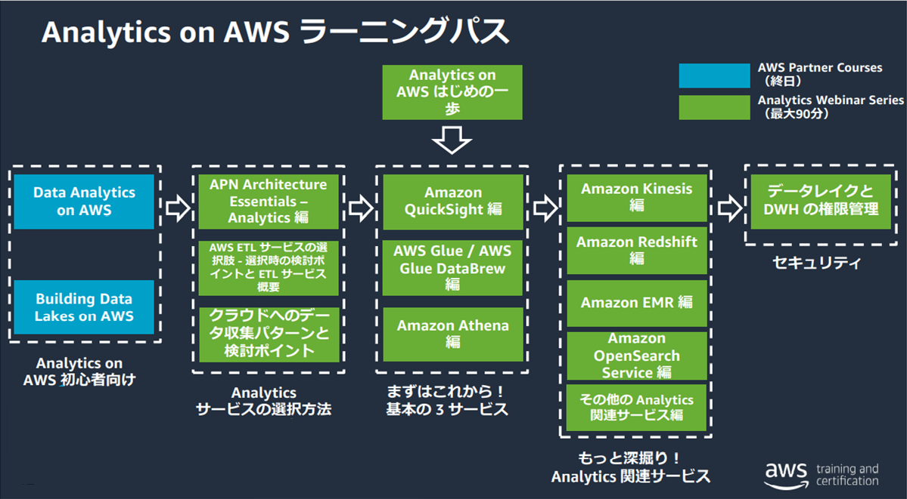

# aws-partner-analytics-roadmap

## 登場人物
- データ所有者
- データ分析者
- データ閲覧者
- セキュリティ担当者
- インフラ担当者

## 完成目標
- データ収集(Data Collection)
  - データ収集の戦略は、障害シナリオを想定し、適切な復旧策を実装することで、耐障害性とデータの冗長性を提供すべきです。データ取り込みシステムは、データ形式や圧縮タイプが異なる複数のデータソースから、データの順序通りに、既存データと増分データの両方が収集できるべきです。
- データの保存と管理(Data Storage and Management)
  - データのストレージは、耐久性、信頼性、永続性があり、さまざまなデータ検索パターンに対して応答時間を短くできるものであるべきです。ストレージは、スキーマ、データ構造、レイアウト、フォーマットの変更に対応できるべきです。データ管理には、データライフサイクルとメタデータ管理が考慮されるべきです
- データ処理(Data Processing)
  - オーケストレーション、スケーリング、テレメトリ、レプリケーション、ディザスタリカバリなどの適切な ETL/ELT 技術を使用して、データ処理ソリューションは、複数のソースからのデータの質や量の向上、変換、および集計を行うべきです
- データ分析と可視化(Data Analysis and Visualization)
  - 目標復旧時点(RPO)もしくは目標復旧時間(RTO)を評価した上で、厳しいサービスレベル契約(SLA)を満たすために、データ分析および可視化レイヤーを開発する必要があります。メトリクス、KPI、表形式、API のデータ可視化は、提供方法（ウェブ、モバイル、電子メール、コラボレーションおよびノートブック）や、データの更新サイクルに基づいて選択すべきです。
- データ分析システムの安全性確保(Securing Data Analysis Systems)
  - 認証（フェデレーション、SSO、IAM）と認可（ポリシー、ACL、テーブルやカラムレベルのアクセス）は、セキュリティ戦略に含まれるべきです。転送中および保管中のデータを保護するために、暗号化を実施すべきです。データガバナンス、監査、およびコンプライアンス管理には、適切な実装をすべきです。最小権限を実現するために、IAM ポリシーで権限を設定する場合、タスクの実行に必要な権限のみを付与してください。これは、特定の条件下で特定のリソースに対して実行できるアクションを定義することで実現されます

## 評価ポイント
- アーキテクチャやソリューション設計の理解
- デモ（動作するもの）
- 技術的なコミュニケーションスキル

## ボーナスポイント
- GxP コンプライアンスの義務に対応すること
- データメッシュ・アーキテクチャを採用する
- 統一されたデータ・アクセス・ガバナンスと data-as-a-product の共有を実現すること

## Learning Path

## Traning
- Data Collect
  - Kinesis
  - Glue/Glue DataBrew
  - Data Migration Service
  - AppFlow
- Data Transform
  - Kinesis
  - Glue/Glue DataBrew
- Data Storage
  - S3
  - Lake Formation
- Data Analytic / Insight
  - Redshift
  - Athena
  - OpenSearch
  - EMR
  - Federated Query
  - QuickSight
- Security
